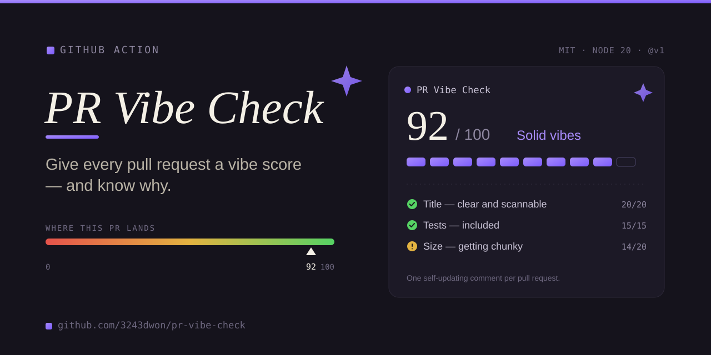

# 🔍 PR Vibe Check™

> *A GitHub Action that reviews your pull request and gives it a brutally honest Gen Z vibe check, powered by Claude.*
>
> **No cap.**

[](https://github.com/3243dwon/pr-vibe-check/actions/workflows/ci.yml)
[](https://github.com/marketplace/actions/pr-vibe-check)
[](https://www.anthropic.com)
[](LICENSE)
[](https://github.com/3243dwon/pr-vibe-check)

<p align="center">
  
</p>

<!-- Once you've recorded a demo (recipe in LAUNCH.md), drop it in here: -->
<!--  -->

---

## What is this

Your CI pipeline runs tests. It checks types. It lints your code.

But does it tell you that your 47-file refactor is giving **main character energy** for absolutely no reason?

Does it let you know your variable naming **ate and left no crumbs**?

Does it clock that your commit message says `fix stuff` and you should be **caught in 4K** for that?

**Now it does.** PR Vibe Check posts one self-updating comment on every PR — the technical read is real (Claude actually reads your diff), the Gen Z wrapper just makes it hit different.

---

## Example output

> ## 🔍 PR Vibe Check™
>
> **✨ THE VIBE**
> This PR understood the assignment — clean auth refactor with solid test coverage, genuinely no cap.
>
> **🔥 SLAY MOMENTS**
> - Extracted the token logic into its own util — fr fr that's how you do it bestie, separation of concerns ate
> - Test coverage on the edge cases?? You didn't have to go that hard but you did. Respect.
> - Commit history is actually readable. Unheard of in this economy.
>
> **💀 L MOMENTS**
> - That TODO comment from 2019 is living rent free in this codebase and it needs to be evicted immediately
> - `handleData` is not a function name, that's a cry for help. Be more specific bestie 💀
> - 312 lines changed for a "small fix"?? The audacity of the PR description is sending me
>
> **🎯 VERDICT**
> W — but the TODO comment situation has you on thin ice fr
>
> **📊 VIBE RATING: 7/10** ✨
>
> ---
> *no cap powered by [pr-vibe-check](https://github.com/3243dwon/pr-vibe-check) × Claude · severity: `normal`*

See more in [docs/example-comment.md](docs/example-comment.md).

---

## Setup

**1. Add your Anthropic API key to repo secrets**

`Settings → Secrets and variables → Actions` → new secret:

```
ANTHROPIC_API_KEY = sk-ant-...
```

Grab a key at [console.anthropic.com](https://console.anthropic.com).

**2. Add the workflow** — `.github/workflows/vibe-check.yml`:

```yaml
name: PR Vibe Check
on:
  pull_request:
    types: [opened, synchronize, reopened]

permissions:
  contents: read
  pull-requests: write   # needed to post the comment

jobs:
  vibe-check:
    runs-on: ubuntu-latest
    steps:
      - uses: 3243dwon/pr-vibe-check@v1
        with:
          anthropic-api-key: ${{ secrets.ANTHROPIC_API_KEY }}
          severity: normal   # soft | normal | brutal
```

Open a PR and let it rip. 🔥

---

## Severity levels

| Level | Vibe |
| :-- | :-- |
| `soft` | Encouraging, hype energy. Good for sensitive codebases or first-time contributors. |
| `normal` | Honest and funny. Roasts when needed, hypes when deserved. **The default.** |
| `brutal` | Zero filter. Absolutely ruthless. You asked for this. |

---

## Inputs

| Input | Required | Default | Description |
| :-- | :--: | :-- | :-- |
| `anthropic-api-key` | ✅ | — | Your Anthropic API key (store in secrets). |
| `github-token` | ❌ | `${{ github.token }}` | Token for reading the PR and posting the comment. |
| `severity` | ❌ | `normal` | `soft` / `normal` / `brutal`. |
| `model` | ❌ | `claude-sonnet-4-6` | Claude model id. Swap to a Haiku for cheaper runs. |
| `comment` | ❌ | `true` | Set `false` to run without posting a comment. |

## Outputs

| Output | Example | Description |
| :-- | :-- | :-- |
| `rating` | `7` | Numeric vibe rating (0–10) parsed from the check. |
| `severity` | `normal` | The severity level used. |

---

## How it works

1. Triggered when a PR is opened or updated.
2. Fetches the diff + PR metadata via the GitHub API.
3. Sends it to Claude with a carefully crafted Gen Z system prompt + your `severity`.
4. **Upserts** a single comment on the PR — it updates its own comment on each push instead of spamming new ones.

The technical analysis is real; the slang is the wrapper, the substance is the gift.

---

## Cost

Each vibe check is one Claude call — roughly **$0.002–0.02** depending on PR size and model. Less than a cent on Haiku. Cheaper than your linter's ego.

---

## Local development

The action is dependency-injected, so you can run the whole thing locally with a mocked `@actions/core` / `@actions/github` and a canned Claude response — no token, no key, no network:

```bash
npm install
npm test           # unit tests (node --test)
npm run test:local # run the action with mocked toolkit; prints the comment it would post
npm run build      # bundle src/ -> dist/index.js with @vercel/ncc
```

> **Always `npm run build` and commit `dist/`** before tagging — GitHub runs the action from the committed bundle. CI enforces this.

---

## Releasing (automated)

Powered by [release-please](https://github.com/googleapis/release-please) + a job that moves the floating `v1` / `v1.x` tags — see [.github/workflows/release.yml](.github/workflows/release.yml). Commit with [Conventional Commits](https://www.conventionalcommits.org), merge the release PR it opens, and `v1` updates itself. Details in [CONTRIBUTING.md](CONTRIBUTING.md).

---

## Contributing

PRs welcome. They will, of course, be vibe checked. See [CONTRIBUTING.md](CONTRIBUTING.md).

---

## License

[MIT](LICENSE) — do whatever bestie, just don't be mid about it. © 2026 [3243dwon](https://github.com/3243dwon)
